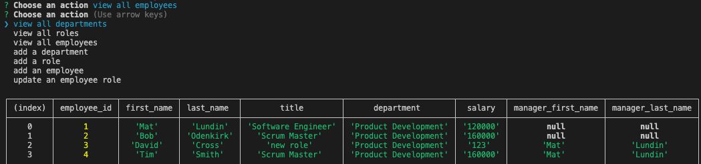

# Employee Tracker

## Description
  This application presents the user with the ability to view and manipulate their organization’s departments, roles, and employees.

## Table of Contents
- [Installation](#installation)
- [Usage](#usage)
- [License](#license)
- [Contributing](#contributing)
- [Tests](#tests)
- [Questions](#questions)

## Installation
To install, download the repository files and run ```npm i``` in the terminal from the root folder to install all dependencies (Express in this case). The database will need to be created and seeded by running the ```schema.sql``` and ```seeds.sql``` files in the mySQL terminal.

## Usage
To use, run ```node app.js``` in the terminal. The prompts will guide the user through views, additions, and role changes via the prompts. In future releases the developer hopes to add choices for adding roles and departments instead of prompting for id numbers.


## License
  [](https://opensource.org/licenses/MIT)

Copyright 2021 Mathew Lundin

Permission is hereby granted, free of charge, to any person obtaining a copy of this software and associated documentation files (the "Software"), to deal in the Software without restriction, including without limitation the rights to use, copy, modify, merge, publish, distribute, sublicense, and/or sell copies of the Software, and to permit persons to whom the Software is furnished to do so, subject to the following conditions:

The above copyright notice and this permission notice shall be included in all copies or substantial portions of the Software.

THE SOFTWARE IS PROVIDED "AS IS", WITHOUT WARRANTY OF ANY KIND, EXPRESS OR IMPLIED, INCLUDING BUT NOT LIMITED TO THE WARRANTIES OF MERCHANTABILITY, FITNESS FOR A PARTICULAR PURPOSE AND NONINFRINGEMENT. IN NO EVENT SHALL THE AUTHORS OR COPYRIGHT HOLDERS BE LIABLE FOR ANY CLAIM, DAMAGES OR OTHER LIABILITY, WHETHER IN AN ACTION OF CONTRACT, TORT OR OTHERWISE, ARISING FROM, OUT OF OR IN CONNECTION WITH THE SOFTWARE OR THE USE OR OTHER DEALINGS IN THE SOFTWARE.

  [MIT License](https://opensource.org/licenses/MIT)
    

## Contributing
This application was built by Mat Lundin.

## Tests
No tests have been built for this application.

## Questions
Any questions can be submitted to the developer via GitHub.

## Demonstration Video
[View Demo](https://watch.screencastify.com/v/g2pQEpdeIGKXQlduLTPy)

You can access this repository [here.](https://github.com/mat-lundin/Homework-12-Employee-Tracker)


